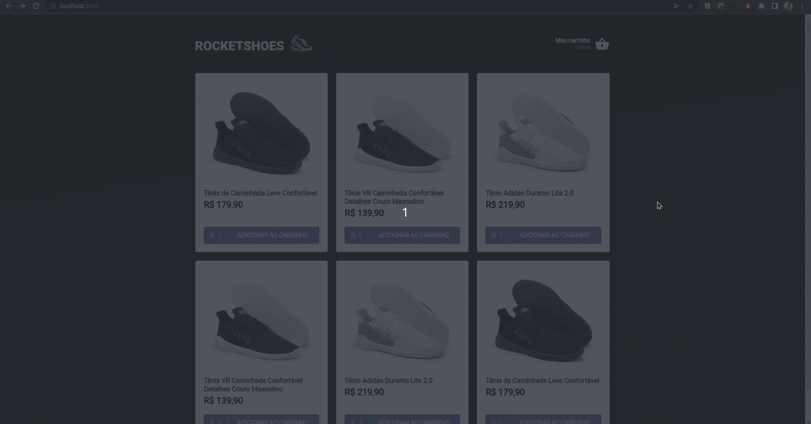

<p align="center">
  
</p>

## 📖 Sobre

Projeto referente ao primeiro desafio do Chapter II - Hook para gerenciar um carrinho de compras.

</br>

## ⚙ Tecnologias

Esse projeto foi desenvolvido com as seguintes tecnologias:

- [React](https://www.reactjs.org)
- [Fake API com JSON Server](https://github.com/typicode/json-server)
- [TypeScript](https://www.typescriptlang.org)

</br>

## 💻 Projeto

A Rocketshoes é uma loja de calçados.

</br>

## 👷 Como executar 🚀

- Clone o repositório
```
git clone https://github.com/ericlys/Desafio-01-M2-reactjs-criando-um-hook-de-carrinho-de-compras.git
```
- Instale as dependências
```
yarn
```
- Inicie o servidor JSON Server
``` 
yarn server
```
- Rodando o projeto
``` 
yarn start
```
- Testes
``` 
yarn test
```
- Acesse no seu navegador
```
http://localhost:3000
```


Feito com 💜 por Ericlys 
